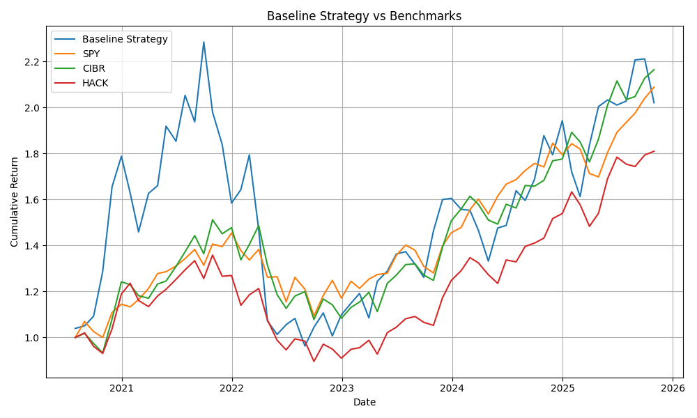
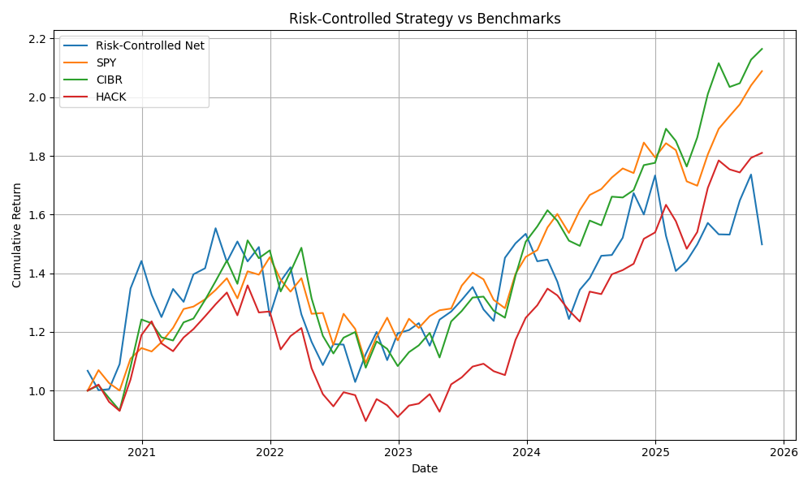
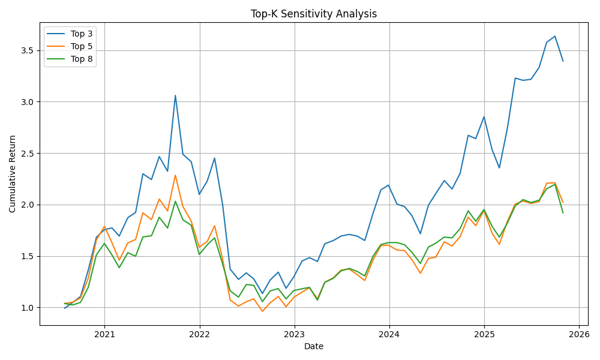
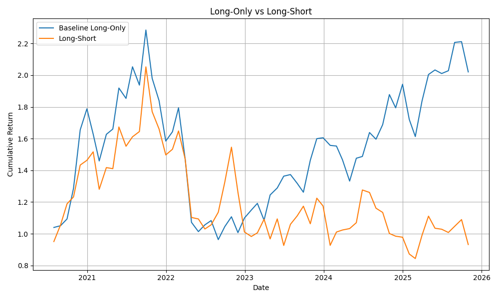
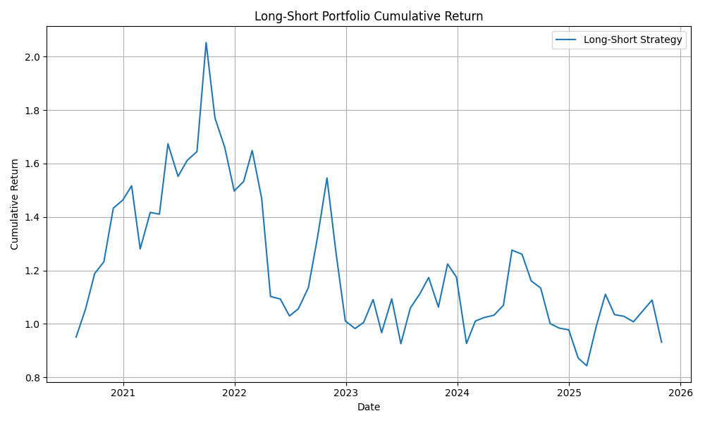
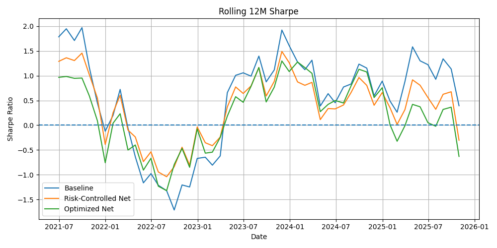

Cybersecurity Quant Equity Research Platform
Overview

This project develops a quantitative research platform to study machine learning–driven alpha signals within the cybersecurity equity sector.

The research investigates whether cross-sectional signals derived from price momentum, volatility, and trading activity can predict forward one-month stock returns.

The platform replicates a simplified buy-side quantitative research workflow, including:

Data pipeline construction

Factor engineering

Machine learning signal generation

Portfolio construction

Transaction cost modeling

Benchmark comparison

Alpha diagnostics

The goal is to simulate a sector-focused systematic equity strategy research process.

Research Workflow

The research pipeline follows a typical quantitative investment workflow.

Data Collection
      ↓
Feature Engineering
      ↓
Machine Learning Alpha Signal
      ↓
Portfolio Construction
      ↓
Backtesting & Diagnostics

Implemented notebooks:

notebooks/

01_data_download_and_cleaning.ipynb
02_factor_engineering.ipynb
03_ml_stock_selection.ipynb
04_strategy_backtest.ipynb
Data Pipeline

The research universe consists of publicly traded cybersecurity companies, including:

CRWD
PANW
FTNT
ZS
OKTA
CYBR
NET
TENB
AKAM
SNPS

Data source:

Yahoo Finance API

Data preprocessing includes:

missing data handling

liquidity filtering

monthly resampling

forward return calculation

Processed datasets are stored in:

data/processed/
Feature Engineering

Several predictive signals were constructed.

Momentum
mom_1m
mom_3m
mom_6m
Volatility
vol_1m
vol_3m
vol_6m
Liquidity
volume_ratio

Target variable:

fwd_ret_1m

These features serve as inputs for the machine learning model.

Machine Learning Alpha Signal

A regression model predicts forward one-month returns.

Training procedure:

walk-forward training
rolling historical window
monthly cross-sectional prediction

Predicted values are interpreted as alpha scores used for portfolio construction.

Portfolio Construction

Multiple portfolio construction approaches were evaluated.

Baseline Strategy
Long-only
Top-N predicted stocks
Equal-weight allocation
Risk-Controlled Portfolio

Enhancements include:

volatility filtering
position caps
transaction cost modeling

This reduces portfolio concentration risk.

Mean-Variance Optimized Portfolio

Portfolio weights are computed using:

expected return = ML prediction
covariance matrix = historical returns

with constraints to avoid extreme allocations.

Subtheme-Neutral Portfolio

Exposure is balanced across cybersecurity subthemes such as:

Endpoint Security
Identity Security
Cloud Security
Network Security
Secure DevOps

This improves diversification and reduces thematic concentration.

Strategy Performance
Baseline Strategy vs Benchmarks

Benchmarks include:

SPY  – S&P 500 ETF
CIBR – Cybersecurity ETF
HACK – Cybersecurity ETF
Risk-Controlled Strategy vs Benchmarks

Risk-controlled portfolios reduce drawdowns but typically produce lower returns.

Strategy Diagnostics
Top-K Sensitivity Analysis

Alpha is concentrated among highest-ranked securities, with the Top-3 portfolio outperforming broader selections.

Long-Only vs Long-Short

The signal demonstrates stronger ability to identify outperformers than underperformers.

Long-Short Portfolio

Market-neutral strategies show limited performance due to the small universe size.

Rolling 12-Month Sharpe Ratio

Rolling Sharpe analysis highlights performance variation across market regimes.

Signal Evaluation

Signal quality is evaluated using the Information Coefficient (IC):

IC = corr(predicted_return , future_return)

Diagnostics include:

IC time series

IC distribution

Rank IC

IC t-statistic

These metrics measure the statistical strength of the predictive signal.

Key Findings

Research results suggest:

Alpha is strongest among top-ranked securities.

Long-only strategies outperform long-short portfolios.

Subtheme diversification improves risk control.

Signal strength is modest due to the relatively small sector universe.

Repository Structure
data/
│
├─ raw/
├─ processed/
└─ external/

notebooks/
│
├─ 01_data_download_and_cleaning.ipynb
├─ 02_factor_engineering.ipynb
├─ 03_ml_stock_selection.ipynb
└─ 04_strategy_backtest.ipynb

outputs/
│
├─ charts/
└─ tables/
Technologies Used
Python
Pandas
NumPy
Scikit-learn
Matplotlib
SciPy
Jupyter Notebook
Disclaimer

This project is for educational and research purposes only and does not constitute investment advice.

Author

Quantitative Research Project
Cybersecurity Sector Alpha Study